# Installation Steps

This guide describes the steps required to set up the **Offline POS – Send Transaction via Storage Queue** telemetry dashboard in Azure Data Explorer.

## Table of Contents

- [Prerequisites](#prerequisites)
- [Step 1 – Set Up the Application Insights Resource](#1-set-up-the-application-insights-resource)
- [Step 2 – Set Up Application Insights on the SaaS Environment](#2-set-up-application-insights-on-the-saas-environment)
- [Step 3 – Set Up Application Insights on Each Offline POS](#3-set-up-application-insights-on-each-offline-pos)
- [Step 4 – Install the Telemetry Extension on the Offline POS](#4-install-the-telemetry-extension-on-the-offline-pos)
- [Step 5 – Create the POS Mapping CSV File](#5-create-the-pos-mapping-csv-file)
- [Step 6 – Create an Azure Storage Account and Container](#6-create-an-azure-storage-account-and-container)
- [Step 7 – Generate a SAS Link for the CSV File](#7-generate-a-sas-link-for-the-csv-file)
- [Step 8 – Import the Dashboard into Azure Data Explorer](#8-import-the-dashboard-into-azure-data-explorer)
- [Step 9 – Update the Data Source](#9-update-the-data-source)
- [Step 10 – Update the POS Mapping CSV Link in the Dashboard](#10-update-the-pos-mapping-csv-link-in-the-dashboard)
- [Reference: Telemetry Events](#reference-telemetry-events)
- [Reference: Dashboard Structure](#reference-dashboard-structure)

## Prerequisites

- Access to the Azure Portal
- An LS Central SaaS environment configured to send telemetry to Application Insights resource in Azure Portal
- One or more Offline POS terminals configured to use the Storage Queue replication method and configured to send telemetry to Application Insights resource in Azure Portal
- User permissions to access the Application Insights resource to fetch the data to the dashboard

---

## Steps

### 1. Set Up the Application Insights Resource

If you do not already have an Application Insights resource, create one in the Azure Portal. If you already have one that you want to use, skip to Step 2.

- Navigate to the Azure Portal and create a new **Application Insights** resource.
- Note the **Connection String** (or Instrumentation Key), as it will be needed in the following steps.

> More information on how to set up a new **Application Insights** resource can be found in the link below:
> [Get started (set up Azure Application Insights)](https://learn.microsoft.com/en-us/dynamics365/business-central/dev-itpro/administration/telemetry-enable-application-insights#appinsights)

---

### 2. Set Up Application Insights on the SaaS Environment

If Application Insights has not yet been configured on the SaaS (Head Office) environment:

- Configure the Application Insights connection string on the SaaS environment to point to the same (or a separate) Application Insights resource.

> More information on how to turn on telemetry for online environments can be found in the link below:
> [Turn on telemetry on environments - For online environments](https://learn.microsoft.com/en-us/dynamics365/business-central/dev-itpro/administration/telemetry-enable-application-insights#for-online-environments)

---

### 3. Set Up Application Insights on Each Offline POS

Configure each Offline POS terminal to send telemetry data to Application Insights:

- On each Offline POS, configure the Application Insights connection string so that telemetry events are forwarded to the Application Insights resource created in Step 1.

> More information on how to turn on telemetry for on-premises environments can be found in the link below:
> [Turn on telemetry on environments - For on-premises environments](https://learn.microsoft.com/en-us/dynamics365/business-central/dev-itpro/administration/telemetry-enable-application-insights#for-on-premises-environments-single-tenant-mode)

---

### 4. Install the Telemetry Extension on the Offline POS

This is an AL extension created by LS Retail that is not yet included in LS Central. Its sole purpose is to trigger and send the telemetry events required to track the sending transactions flow, which are the events used by this dashboard.

The extension `.app` file is located in this repository at:

```
al-telemetry-app/LS Retail - CAP_Replication Telemetry_1.0.0.0.app
```

Install the telemetry extension on each Offline POS:

- Deploy the extension to each Offline POS environment using the **Extension Management** page in Business Central (upload the `.app` file).
- Verify that telemetry events are being received in Application Insights after installation.

---

### 5. Create the POS Mapping CSV File

Create a CSV file that maps each Offline POS terminal. The file must have the following structure:

| Store No. | POS Terminal No. | User Telemetry Id | POS Name |
|-----------|-----------------|-------------------|----------|
| S0001     | P0001           | a80b5118-f872-4342-a358-7de8b5c6e111 | Store 1 - POS 1     |
| S0001     | P0002           | 07a95fc3-aff1-4c89-a453-9b13f48f6460 | Store 1 - POS 2     |
| S0001     | P0003           | 56636151-71ca-4a45-9c05-89bb16e849f6 | Store 1 - POS 3     |
| S0002     | P0004           | 7dc0d0e0-ea73-4d60-b3a7-b4b23e9a4d7d | Store 2 - POS 4     |

The .csv file looks like this:

```
"Store No.","POS Terminal No.","User Telemetry Id","POS Name"
S0001,P0001,a80b5118-f872-4342-a358-7de8b5c6e111,Store 1 - POS 1
S0001,P0002,07a95fc3-aff1-4c89-a453-9b13f48f6460,Store 1 - POS 2
S0001,P0003,56636151-71ca-4a45-9c05-89bb16e849f6,Store 1 - POS 3
S0002,P0004,7dc0d0e0-ea73-4d60-b3a7-b4b23e9a4d7d,Store 2 - POS 4
```

> **Note:**
> - The combination of `Store No.` and `POS Terminal No.` is the unique key for each row.
> - **User Telemetry Id** : a GUID that can be retrieved from the **User Card** for the POS user (open the User Card in Business Central → locate the **User Telemetry Id** field).
> - **POS Name** : friendly name for the POS (used for display in the dashboard).

Save the file as `pos-mapping.csv`.

> **Tip:** An example file is available in the `azure-data-explorer-dashboard/data/` folder in this repository. You may rename the file, but if you do, make sure the SAS link generated in Step 7 and the base query updated in Step 10 both reference the correct file name.

---

### 6. Create an Azure Storage Account and Container

Create a storage location where the POS mapping CSV file will be hosted:

- In the Azure Portal, create a new **Storage Account** (or use an existing one).
- Inside the storage account, create a **Blob Container** (e.g., `offlinepos-dashboard`).
- Upload the `pos-mapping.csv` file to the container.

> More information on how to set up an Azure Storage Account can be found in the LS Central Implementation Guide:
> [How to Set Up Azure Storage](https://help.lscentral.lsretail.com/Content/LS-Retail/Replication/Web-Replication-Azure/How-To-Setup-Azure-Storage.htm)

---

### 7. Generate a SAS Link for the CSV File

Generate a Shared Access Signature (SAS) URL to allow the dashboard to read the CSV file:

- In the Azure Portal, navigate to the uploaded `pos-mapping.csv` blob and click on it
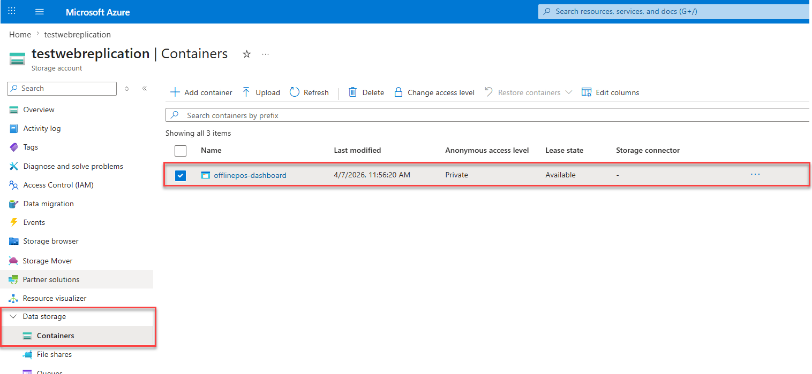
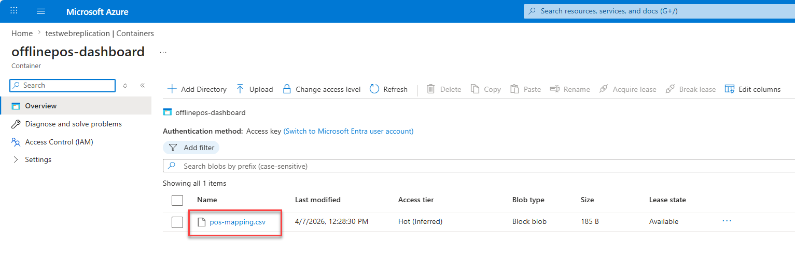

- Generate a **SAS token** with at least **Read** permission and an appropriate expiry date (it should be fine to set the expire date to 5 years from now)
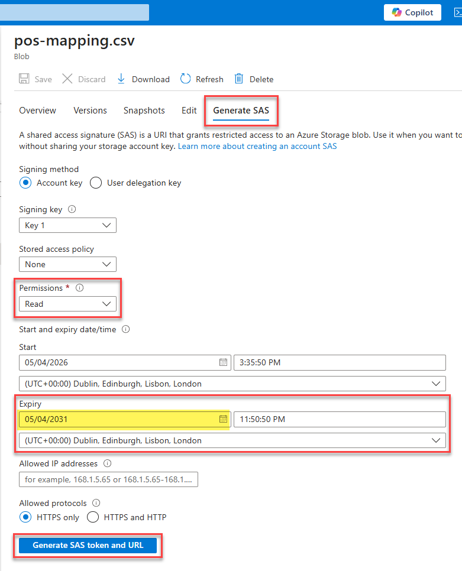

> **Security note:** Only grant **Read** permission on the SAS token. Do not grant Write or Delete. Remember to regenerate the SAS token before it expires to avoid dashboard failures.

- Copy the full **Blob SAS URL** - it will be used in the dashboard base query, in Step 10.
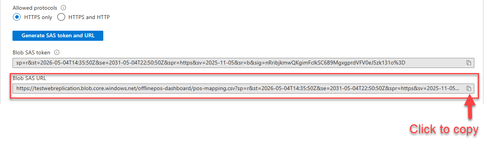

---

### 8. Import the Dashboard into Azure Data Explorer

Create a new dashboard and import the provided dashboard definition:

- Navigate to **Azure Data Explorer** ([dataexplorer.azure.com](https://dataexplorer.azure.com)) and go to **Dashboards**.
- Create a new dashboard by clicking on the **Import dashboard from file** option.
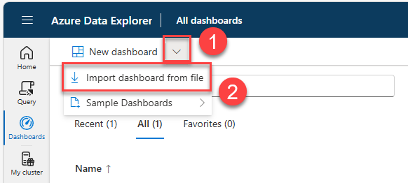

- Select the `.json` file from this repository to import the dashboard.

- Use the default title or name it as you want.

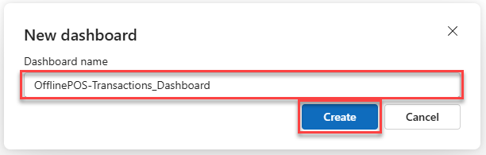

---

### 9. Update the Data Source

After importing, update the dashboard data source to point to the customer's own Application Insights resource:

- Click on the imported dashboard to open it<br>
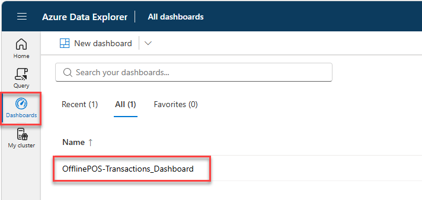

- In the imported dashboard, open **Data sources**.<br>
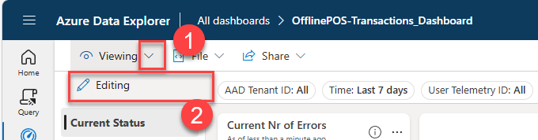

- Click on **Data sources** to list the data sources in the dashboard<br>
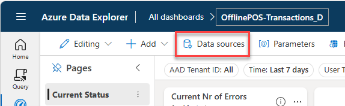

- Click on the cog wheel to edit the data sources (only one is listed and being used)<br>
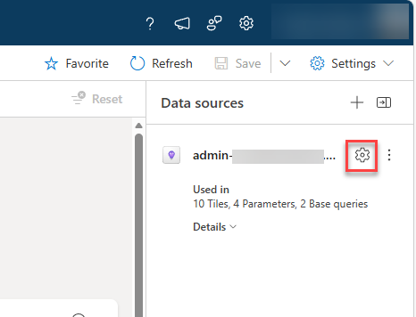

- Under the **Data source settings** menu, update the fields accordingly:<br>

    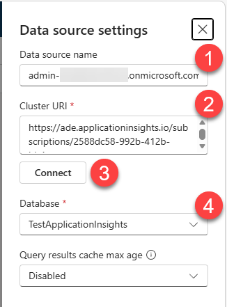

    1. Name the new data source as you want (e.g. **LS Central Telemetry**)
    2. Enter the **Cluster URI** using the following template (replace the placeholders with your values):

        ```
        https://ade.applicationinsights.io/subscriptions/{SUBSCRIPTION-ID}/resourceGroups/{RESOURCE-GROUP}/providers/microsoft.insights/components/{APP-INSIGHTS-NAME}
        ```

        **How to get the values to replace in the placeholders?**

        All the values can be obtained from the Application Insights resource in Azure Portal.
            
        - **Option A: From the URL bar**<br>

            Open the Application Insights resource in Azure Portal, copy the url and get all the values from the url.
            For example: `https://portal.azure.com/#@xxxxxxxxxx.onmicrosoft.com/resource/subscriptions/2588dc58-992b-xxxx-xxxx-xxxxxxxxxx/resourceGroups/DefaultResourceGroup-NEU/providers/microsoft.insights/components/TestApplicationInsights/overview`
                
            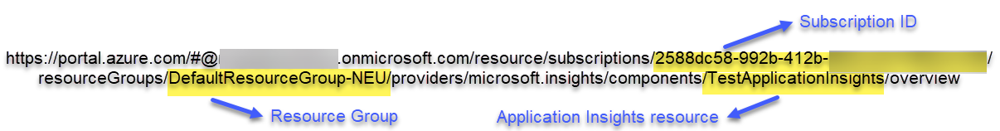

        - **Option B: From the resource properties**<br>
              
            Open the Application Insights resource in Azure Portal, and obtain the values directly from the Application Insights resource:

            * **Subscription ID**<br>
            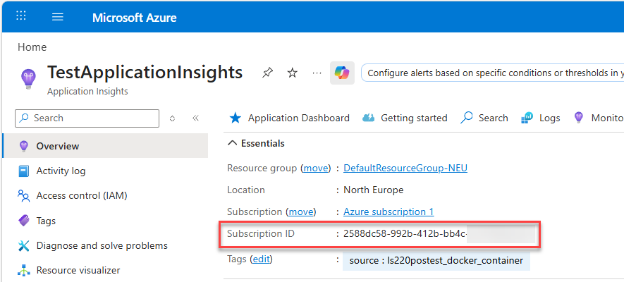
            * **Resource Group**<br>
            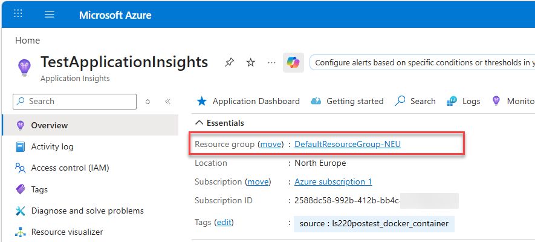
            * **Application Insights resource name**<br>
            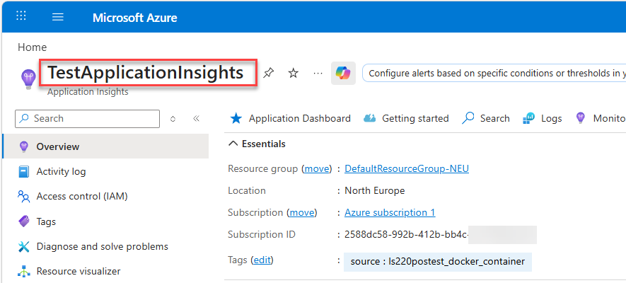

        For the Application Insights resource provided in the screenshots, the **Cluster URI** would be:<br>
        `https://ade.applicationinsights.io/subscriptions/2588dc58-992b-412b-bb4c-xxxxxxxxxxxx/resourceGroups/DefaultResourceGroup-NEU/providers/microsoft.insights/components/TestApplicationInsights`


    3. Click on **Connect** to connect to Application Insights
    4. Select the database from the drop down list, that should have the same name as the Application Insights resource.

    5. Click on **Apply** to save the changes in the datasource
    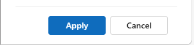

    > **Important:**<br>
    > Click on **Save** button to save the changes in the **Data sources**.
    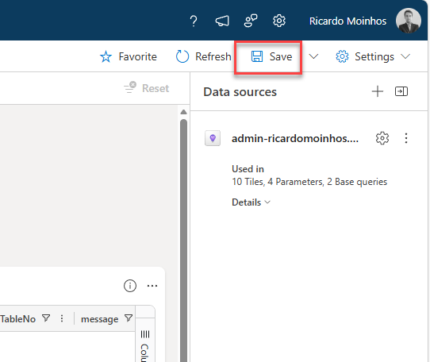

---

### 10. Update the POS Mapping CSV Link in the Dashboard

The dashboard uses a **Base Query** to load the POS mapping data from the CSV file hosted in the Azure Blob Storage container created in Step 6. This base query contains a SAS URL that points to the `pos-mapping.csv` file. Since the SAS URL is customer-specific — it encodes the storage account, container, and access token — it must be updated after importing the dashboard so that it points to the customer's own file.

Without this update, the dashboard will either fail to load POS mapping data or reference an incorrect or expired URL.

To update the base query:

- In the imported dashboard, click **Edit** to enter edit mode.
- Open **Base queries** from the dashboard menu<br>
    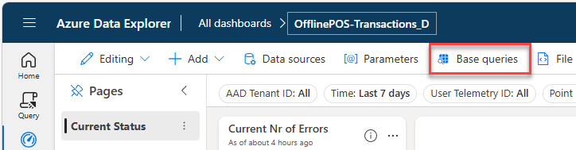

- Locate the base query named **pos_mapping** (or equivalent) and edit it by clicking on the pencil
    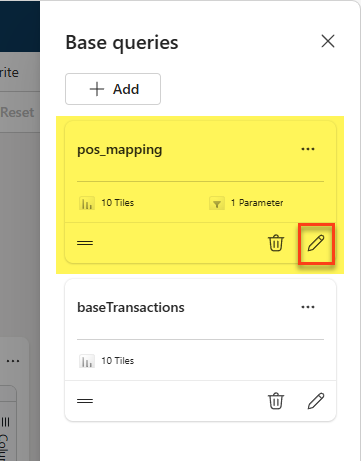

- Replace the existing SAS URL inside the `externaldata` expression with the **Blob SAS URL** generated in Step 7.
    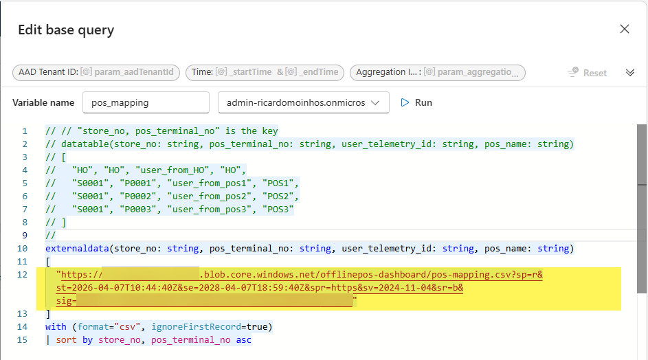

The base query should look like this after the update:

```kql
externaldata(store_no: string, pos_terminal_no: string, user_telemetry_id: string, pos_name: string)
[
    "<your-blob-sas-url>"
]
with (format="csv", has_header_row=true, ignoreFirstRecord=true)
| sort by store_no, pos_terminal_no asc
```

> **Note:** You can click on **Run** to run the query and test the results:
> 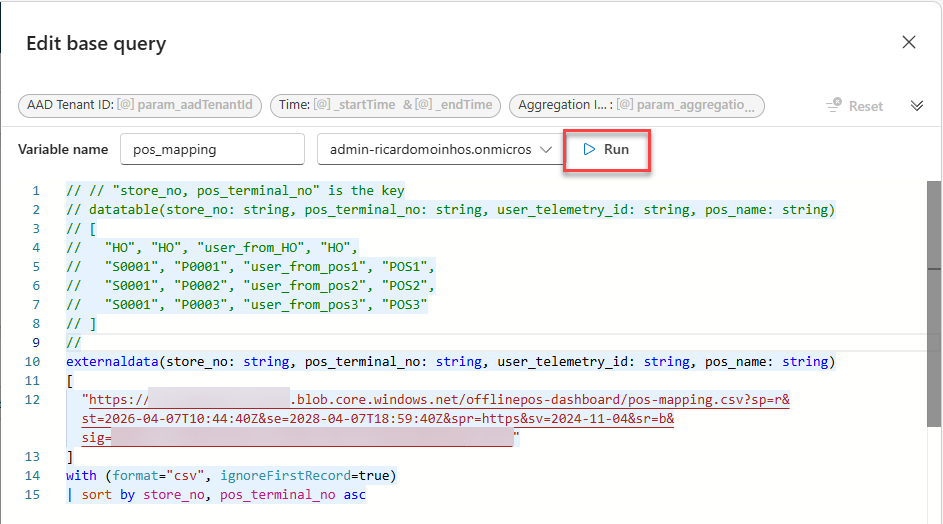
> 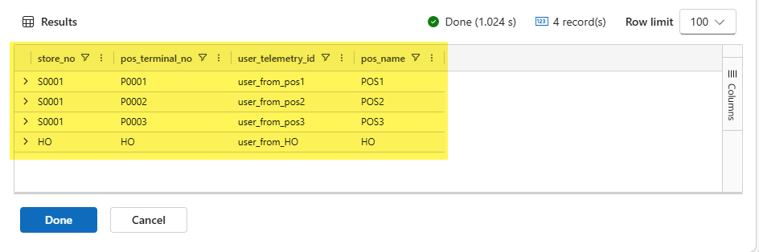

- Click **Done** and then **Save** to persist the changes.

> **Important:** Always remember to click **Save** on the dashboard after making changes to base queries.

---
---

## Reference: Telemetry Events

The dashboard is built on a single custom telemetry event emitted by the telemetry extension installed in Step 4:

| Event ID   | Description                                      |
|------------|--------------------------------------------------|
| `10012870` | Send Transaction via Storage Queue – lifecycle event |

All lifecycle steps emit the **same event ID**. The current stage and outcome of a transaction are determined by the `Stage` and `Result` dimensions carried in the event.

### Lifecycle Stages

| Stage     | Meaning                                              |
|-----------|------------------------------------------------------|
| Posted    | Transaction successfully posted in POS               |
| Enqueued  | Transaction JSON stored + pointer queued in Azure    |
| Applied   | Transaction fetched and applied in Head Office       |

### Results

| Result  | Meaning                    |
|---------|----------------------------|
| Success | Stage completed successfully |
| Error   | Stage failed               |

### Example Event Matrix

| Stage    | Result  | Purpose                              |
|----------|---------|--------------------------------------|
| Posted   | Success | Transaction created in POS           |
| Enqueued | Success | Sent to Azure successfully           |
| Enqueued | Error   | Azure send failure                   |
| Applied  | Success | Applied in Head Office               |
| Applied  | Error   | Failed to apply in Head Office       |

---

## Reference: Dashboard Structure

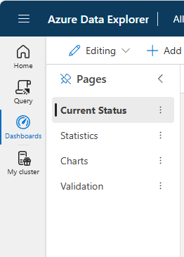

### Current Status page

The **Current Status** page provides a real-time overview of the transaction replication state across all Offline POSes. It is the main page of the dashboard and is intended for day-to-day monitoring.

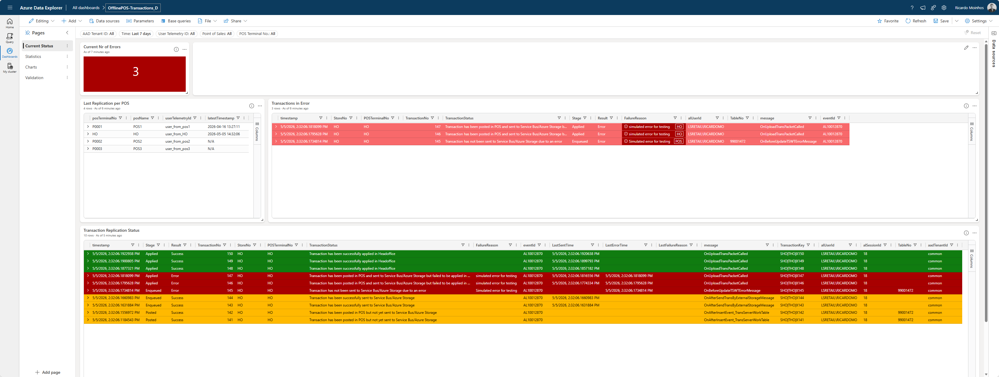

---

#### Current Nr of Errors

Shows the total count of transactions that are currently in an error state - meaning they have at least one error event and have not yet been successfully applied in Head Office. The card is highlighted in **green** when there are no errors and **red** when one or more errors are present.

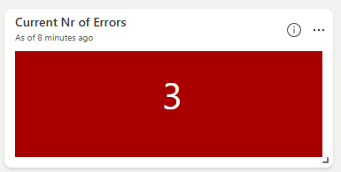

---

#### Last Replication per POS

Lists all Offline POSes defined in the POS mapping table, together with the timestamp of the most recent telemetry event received from each POS. This panel gives a quick indication of which POSes are actively sending data and helps identify POSes that may have stopped replicating.

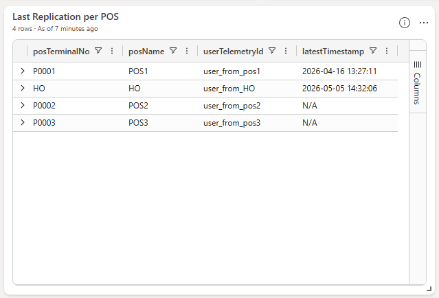
---

#### Transactions in Error

A table listing all transactions that have encountered an error and have not yet recovered (i.e., they were never successfully applied in Head Office). For each transaction, the table shows the store, POS terminal, transaction number, the stage where the error occurred (POS or Head Office), and the failure reason.

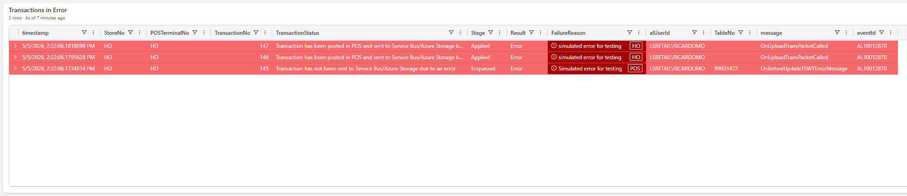

---

#### Transaction Replication Status

A detailed table showing the latest known state for every transaction within the selected time range. Each row represents one transaction and reflects its most recent lifecycle event - from posted at the POS, through enqueued to Azure, to applied in Head Office. Rows are colour-coded to make the status immediately visible:

| Colour | Meaning |
|--------|---------|
| Yellow | Transaction posted at POS but not yet sent, or waiting to be applied in Head Office |
| Green  | Transaction successfully applied in Head Office |
| Red    | Transaction failed at some stage |

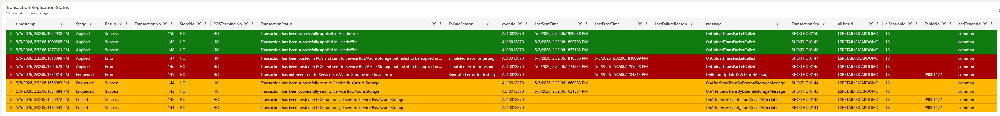

---

### Validation page

The **Validation** page is a diagnostic tool to help ensure the POS mapping configuration is consistent with the telemetry data being received. It cross-references the `pos-mapping.csv` file (loaded via the `pos_mapping` base query) against the actual Store and POS Terminal combinations seen in the telemetry events, and surfaces any discrepancies in two directions:

- **Store / POS Terminal No. missing in telemetry** : Lists entries that are present in the POS mapping file but for which no telemetry events have been received. This can indicate a POS that has not yet been configured to send telemetry, or one that is no longer active.

- **Store / POS Terminal No. missing in POS Mapping table** : Lists Store/POS Terminal combinations that appear in the telemetry data but are not mapped in the `pos-mapping.csv` file. This means the dashboard cannot resolve a friendly POS name for those terminals, and they may be excluded from filtered views.

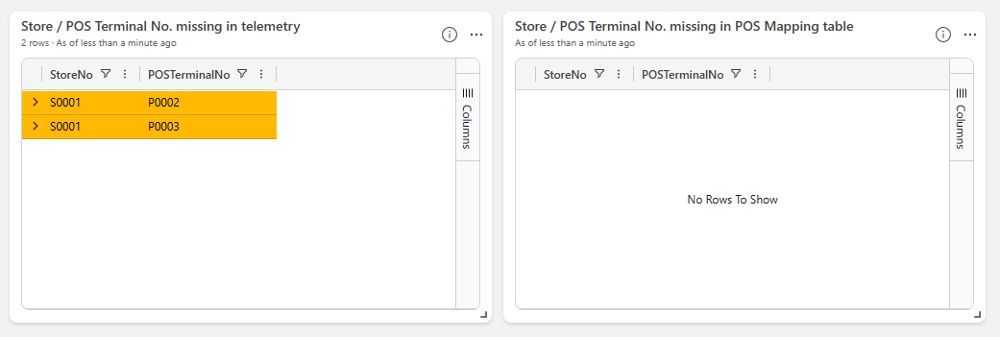

Reviewing this page after the initial setup is recommended to confirm that all active POSes are correctly represented in the mapping file and that telemetry is being received as expected.
